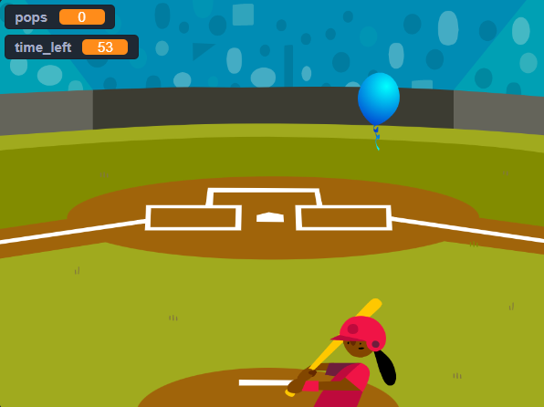

# Balloonball

Game made in Scratch where the player controls a baseball batter with their mouse, the batter's x position follows that of the mouse and they bat a ball in a straight trajectory. Balloons will show up on the left side of the screen and will make their way towards the right side with a time-based constant acceleration. If any baseball contacts a ballon, the later will pop; the player has 60 seconds to pop as many balloons as possible before the game ends.

