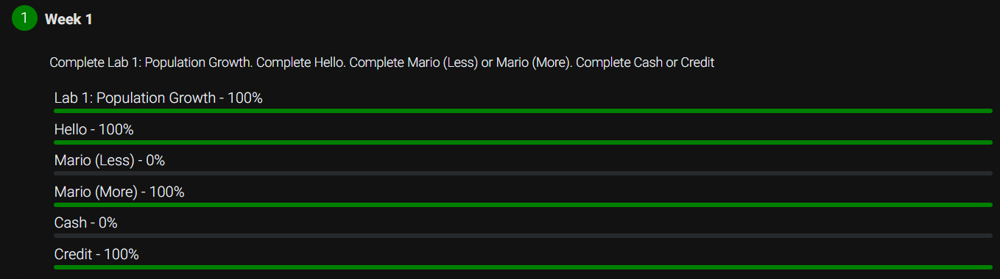

# Week 1: C Fundamentals

This week included the following 4 activities:

- [x] hello: Simple greeting app
- [x] population: Llama population predicting app
- [x] mario: Display a mirrored hash-pyramid, based on the Super Mario franchise
- [x] credit: Validate a credit card number, given the problem's constraints

## Score

