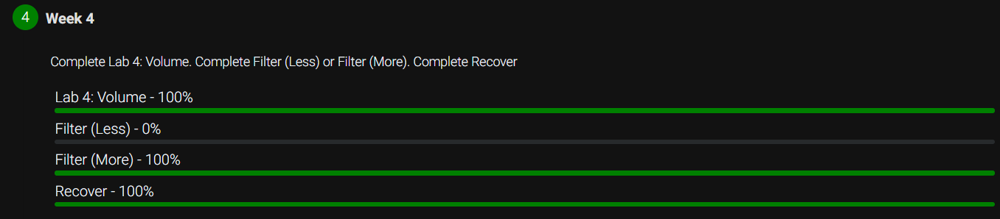

# Week 4: Memory

This week included the following 3 activities:

- [x] lab4: Modifies the volume of an audio file
- [x] filter: Implement multiple image filters
- [x] recovery: Recover jpg files from a forensic image

## Score

