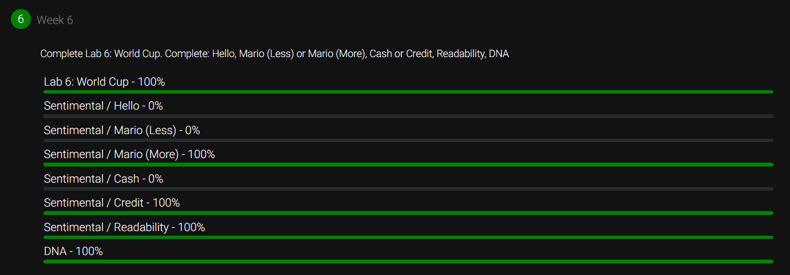

# Week 6: Python

This week included the following 5 activities:

- [x] lab6: Simulate a soccer world cup
- [x] Mario: Print a mirrored hash-pyramid based on user input
- [x] Credit: Implement a program that determines whether a provided credit card number is valid according to Luhn’s algorithm.
- [x] Readability: Implement a program that computes the approximate grade level needed to comprehend some text.
- [x] DNA: Implement a program that identifies a person based on their DNA, per the below.

## Score

