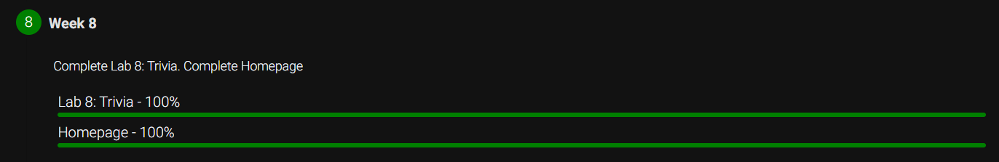

# Week 8: HTML, CSS, JavaScript

This week included the following 2 activities:

- [x] lab8: Write a webpage that lets users answer trivia questions.
- [x] Homepage: Print a mirrored hash-pyramid based on user input

## Score

