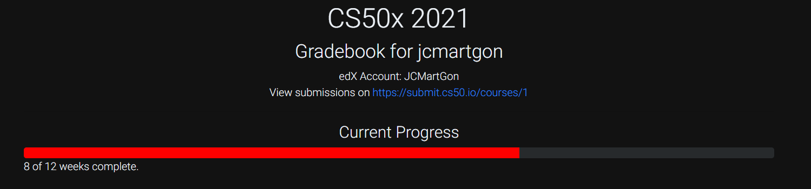

# Harvard's CS50's Introduction to Computer Science

## Course official description

Introduction to the intellectual enterprises of computer science and the art of programming. This course teaches students how to think algorithmically and solve problems efficiently. Topics include abstraction, algorithms, data structures, encapsulation, resource management, security, software engineering, and web programming. Languages include C, Python, and SQL plus HTML, CSS, and JavaScript. Problem sets inspired by the arts, humanities, social sciences, and sciences. Course culminates in a final project. Designed for concentrators and non-concentrators alike, with or without prior programming experience. Two thirds of CS50 students have never taken CS before. Among the overarching goals of this course are to inspire students to explore unfamiliar waters, without fear of failure, create an intensive, shared experience, accessible to all students, and build community among students.

## Contents

01. [x] Scratch
02. [x] C
03. [x] Arrays
04. [x] Algorithms
05. [x] Memory
06. [x] Data Structures
07. [x] Python
08. [x] SQL
09. [x] HTML, CSS, JavaScript
10. [ ] Flask
11. [ ] Ethics

## Current progress

